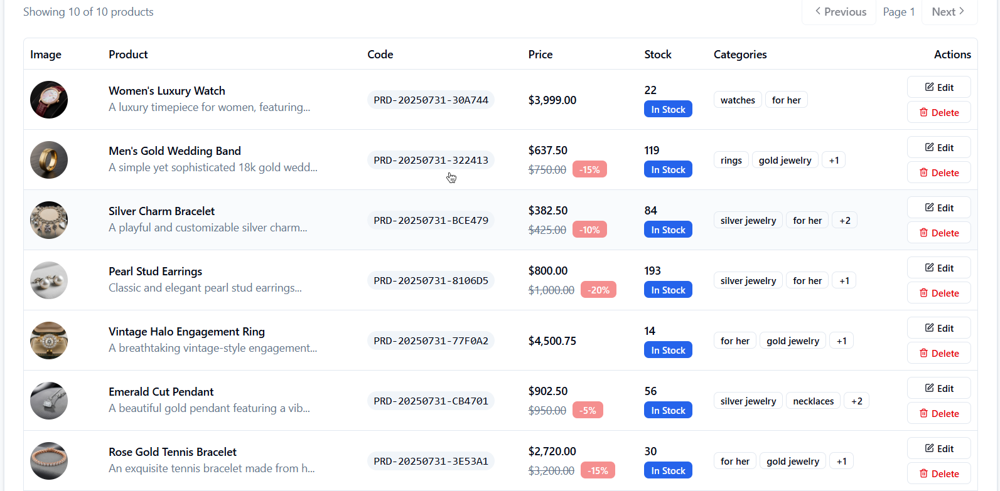

# eshop

A robust e-commerce REST API built with ASP.NET Core, primarily designed for a Flutter mobile application, complemented by a modern Next.js admin dashboard for platform management.

## Related Repositories
- 📱 Mobile App: [eshop-flutter](https://github.com/YousefDewidar/eshop_mobile_app) - Flutter-based mobile application
- 🎯 Dashboard: Current repository includes the Next.js admin interface

## Overview
This repository contains both the backend API and the administration dashboard. The API is designed with mobile-first principles, optimized for the Flutter mobile app, while the Next.js dashboard provides a comprehensive interface for platform management.

## Screenshots

📱 Mobile App Screenshots

### Mobile Application

*Flutter mobile application showcasing the main shopping experience*

🖥️ Admin Dashboard Screenshots

### Dashboard Interface

*Products listing and management interface*

*Detailed product information and editing*

*Order management and tracking system*

*Offer creation and management interface*

*Coupon system and discount management*

## Features

### User Management & Authentication
- **User Registration and Login**: Complete account management system
    - Email-based registration with verification
    - Secure password management with reset capabilities
    - OTP (One-Time Password) system for enhanced security
- **Google OAuth 2.0 Integration**:
    - Web application flow with authorization code
    - Mobile application flow with ID tokens
- **JWT-based Authentication**: Secure token-based authentication system

### Product Management
- **Advanced Search and Filtering**: Powerful product listing endpoint (`/api/products`):
    - **Full-Text Search**: Smart `SearchTerm` parameter for names and descriptions
    - **Filtering**: Comprehensive filters for `Category`, `MinPrice`, `MaxPrice`, and `IsInStock`
    - **Sorting**: Flexible sorting with `SortBy` and `SortOrder` parameters
    - **Pagination**: Efficient data loading with `Page` and `PageSize` controls

### Cart & Order Management
- **Shopping Cart**:
    - Add, update, and remove items with quantity control
    - Real-time stock validation
    - Coupon integration for discounts
- **Order Processing**:
    - Streamlined checkout process
    - Comprehensive order history
    - Admin order management interface
    - Order status tracking

### Address Management
- **User Addresses**:
    - Multiple address support per user
    - Comprehensive address details (state, city, street, apartment)
    - Phone number validation
    - Delivery notes support
    - Default address selection

### Reviews & Ratings
- **Product Reviews**:
    - Star rating system (1-5 scale)
    - User comments with moderation
    - Review management for admins
    - Rating analytics and statistics

### Notification System
- **User Notifications**:
    - Individual user notificaions
    - Broadcast notifications to all users
    - Read/unread status tracking
    - Notification history and management

### Promotional Features
- **Offers Management**:
    - Create and manage promotional offers
    - Custom offer images and descriptions
    - Time-based promotions

### File Management
- **Image Handling**:
    - Secure image upload system
    - R2 object storage integration
    - Public URL generation
    - Image optimization

### Payment System
- **Paymob Integration**:
    - Secure payment gateway integration
    - Real-time transaction processing
    - Webhook-based status updates
    - Transaction history and reporting
    - Multiple payment method support

## Tech Stack

### Backend
- **Framework**: ASP.NET Core 9.0
- **ORM**: Entity Framework Core
- **Database**: SQL Server
- **Authentication**: JWT & OAuth 2.0

### Frontend
- **Mobile**: Flutter Application
- **Dashboard**: Next.js 15 with React 19
- **State Management**: React Query
- **Styling**: Tailwind CSS

### Infrastructure
- **Cloud Storage**: Cloudflare R2 Object Storage
- **Payment Gateway**: Paymob
- **Email Service**: SMTP Integration

## Getting Started
**Configuration**
   - Set up your environment variables in `appsettings.json` you can find an example with all field to provide. 
   - Configure Google OAuth credentials
   - Set up Paymob API keys
   - Configure R2 storage credentials

   - On first run the application will run the migrations and seed the roles
